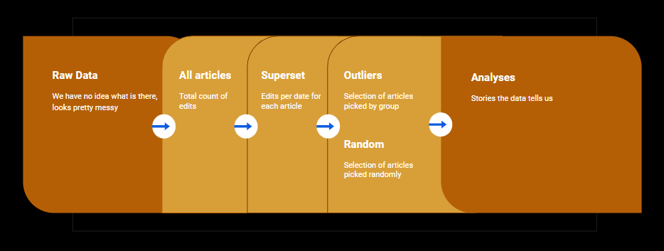
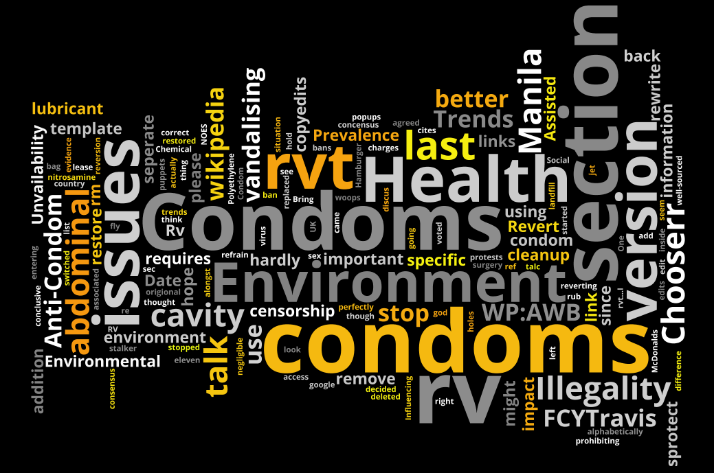

```{r setup, include=FALSE}
#Packages
knitr::opts_chunk$set(echo = TRUE)
library(revealjs)
library(tidyverse)
library(pander)


#Loading data
raw.txt <- "REVISION 12 122974 Anarchism 2002-07-23T01:12:22Z Brion_VIBBER 51
CATEGORY IMAGE MAIN Syndicalism Nihilism Gustave_de_Molinari Benjamin_Tucker
Benjamin_Tucker Noam_Chomsky Peter_Kropotkin Leo_Tolstoy Leo_Tolstoy
Classical_liberalism Individualist_anarchism Individualist_anarchism
Individualist_anarchism Individualist_anarchism Libertarianism Libertarianism
Anomie Anomie Mutual_aid Mutual_aid General_strike Atheism Free_Spirit
Libertarian_socialism Libertarian_socialism Libertarian_socialism
Lysander_Spooner Capitalism Mikhail_Bakunin Self-defense Political Minarchism
Punk_rock William_McKinley Anarcho-syndicalists Karl_Marx Anarchism/Todo
Coercion John_Locke Anarcho-capitalism Anarcho-capitalism Anarcho-capitalism
Anarcho-capitalism Regicide Government Michael_Bakunin Property_damage
Max_Stirner Rudolph_Rocker Peter_Kroptkin Non-violent_resistance Proudhon
David_Friedman Voltairine_de_Cleyre TALK USER USER_TALK OTHER Pl:Anarchizm
Fr:Anarchisme Eo:Anarkismo EXTERNAL TEMPLATE COMMENT lang links: +fr, pl
MINOR 1 TEXTDATA 1169"

output.txt <- "REVISION 12 18201 Anarchism 2002-02-25T15:00:22Z ip:Conversion_script
p:Conversion_cript
CATEGORY
IMAGE
MAIN Syndicalism Nihilism Gustave_de_Molinari Benjamin_Tucker Benjamin_Tucker 
inarchism Noam_Chomsky Punk_rock Fascism Anarchism/Todo Coercion John_Locke 
eo_Tolstoy Anarcho-capitalism Anarcho-capitalism Anarcho-capitalism 
TALK Anarchy Anarchism
USER
USER_TALK
OTHER
EXTERNAL http://dwardmac.pitzer.edu/anarchist_archives/kropotkin.html
http://recollectionbooks.com/bleed/sinners/RockerRudolf.htm
http://www.wikipedia.com/wiki.cgi?action=history&id=Anarchy
TEMPLATE
COMMENT Automated conversion
MINOR 1
TEXTDATA 1214"

top1000_revisions_in_a_day <- read_csv("top1000_revisions_in_a_day.csv")
inital_output_example <- read_csv("inital_output_example.csv")
```

# Introduction

## Original Data


- Complete edit history of all Wikipedia (2001-2008).

- Original zip file > 18 GB, unzipped raw data file > 291 GB. 


## Our project

<ol>
  <li>Edit Wars?</li>
  <li>How we found them</li>
  <li>A closer look into the articles for *Barnard's Star* and *Condoms*</li>
</ol>


# What are edit wars and how to find them?

## Process Flow



## Raw Data - Munging

```{r raw data}
cat(raw.txt)
```

## First look at the structured data

```{r}
cat(output.txt)
```


## What does 291 GBs of data give us?

* 2,953,385 Unique Articles
    <br>
* 116,590,855 Edits

## All articles: *What does it look like?*

```{r}
pandoc.table(head(inital_output_example), justify = 'right')
```

## Superset: Making sense of the data!

Getting a list of articles edited by date:

```{r}
pandoc.table(head(top1000_revisions_in_a_day[,1:3], 6), justify = 'right')
```

## Data Structure and fields we used

<ul style="list-style-type:square">
  <li> `REVISION` ***</li>
  <li> `CATEGORY` </li>
  <li> `IMAGE`</li>
  <li> `MAIN` </li>
  <li> `EXTERNAL` </li>
  <li> `TEMPLATE` </li>
  <li> `COMMENT` *** </li>
  <li> `MINOR` </li>
  <li> `TEXTDATA` </li>
</ul>


## Datasets

- *Superset*
    * A list of every article's date and number of edits for that date.
    
    <br>
    
- *Outliers*
    * The mean number of edits per day for each article (top 5\%).
    
    <br>

- *Random*
    * Excluding the previous 67 articles, we radomly picked another 67 articles.
    

<!-- -------------------------------- -->

# Found something we can actually use! Now what?

## Number of comments and unique users

- Take a look at the data
- Assumptions
- Goals

## Top 10 Edits:

<iframe src="https://public.tableau.com/views/WikipediaEdits/Top10Edits?:embed=y&:display_count=yes"></iframe>


## Bickering and Vandalism 

 <br>


- "Edit-War" Flag: $\qquad \dfrac{\# \text{unique users}}{\# \text{comments}}$
 
 <br>

- Troll Flag: Count of the vandalism tag per article

## Top 10 Edit Wars

<section>
<iframe data—src="https://public.tableau.com/views/WikipediaEdits/Low10?:embed=y&:display_count=yes&publish=yes" style='width:900px; height: 500px;'></iframe>
</section>


<iframe src="https://public.tableau.com/views/WikipediaEdits/Low10?:embed=y&:display_count=yes&publish=yes"></iframe>

## Goals

  <br>

- Create a methodology
- Find something interesting
- Tell a story

  <br>

We found several good stories to tell, we brought you two.

<!-- -------------------------------- -->


# Barnard's Star

## What triggered the mass edits?


<a href="https://en.wikipedia.org/wiki/Barnard%27s_Star" data-preview-link>Barnard's Star</a>

Barnard’s Star was the wikipedia “article of the day” when it saw its spike in edits. We attribute the spike in edits to be due to the people “trolling” this article due to its unexpected exposure as being selected as the article of the day on October 18, 2007.

[Featured Article](https://en.wikipedia.org/wiki/Wikipedia:Today%27s_featured_article/October_18,_2007)


## Wordcloud


## Choropleth


<!-- -------------------------------- -->

# Condom

## What triggered the mass edits?


<a href="https://en.wikipedia.org/wiki/Condom" data-preview-link>Condom</a>

On December 25, 2005, the Catholic Church released a statement stating that “Safe sex” in regards to sexual activity using condoms is not actually safe.  The condom article saw its spike in edits on December 26, 2005 - one day after this released statement. 

[Statement](https://catholicnews.sg/index.php?option=com_content&view=article&id=709:e2809csafe-sexe2809d-is-not-really-safe&catid=140:december-2005&Itemid=473&lang=en)


## Chat

```
08:42:42	Locke_Cole  	/* Proper use */ restoring proper use section 
08:46:10	Chooserr    	this was already voted on, bring it up on the talk 
                        page before making edits like tht 
08:51:07	Locke_Cole   	rvt 
08:57:40	Chooserr    	rvt it was agreed on 
10:35:47	FCYTravis   	/* Condoms & the Environment */ Stupid. You might as well 
                        add such a section to [[McDonalds]] or [[Hamburger]] or [[Soda]]. 
10:43:10	FCYTravis   	/* Environmental impact */ 

16:36:26	Locke_Cole  	rvt - rewrite was better 
16:46:57	63.22.0.39	rvt - censorship 
16:50:51	FreplySpang	  rv: Agree that FCYTravis' rewrite was better, and no, it's not                                 censorship. Discuss on talk if you disagree. 
16:59:36	63.22.0.39	rvt - and since you're using puppets to avoid 
                        [[WP:3RR|the 3RR rule]], I'll count this as your 3rd rvt 
17:18:46	63.22.0.39	restore {{sprotect}} template 
17:29:11	FreplySpang	  remove misused sprotect template; revert to FCYTravis' version as                              discussed on talk 
19:12:37	Chooserr	    /* Environmental impact */ put my version back - has specific sources
                        - but left the bit about Polyethylene condoms and their landfill mass
                        being negligible because that is important 
20:40:12	FCYTravis	    rm sensationalism "holy god no condoms are damaging the environment OH
                        NOES!!!!111!!eleven!1!1!" Bin it. 
21:04:54	63.22.55.169	rvt to last concensus version, abusive edit summaries won't get you
                        anywhere 
21:11:40	FCYTravis	    There's hardly a consensus for that version. 
21:18:13	63.22.55.169	rv to last (pre-troll)version 
21:25:35	La_goutte_de_pluie	rv censorship 
```


## Wordcloud



## Edit War Flags

Dataset: Outlier, Article: Condom, UniqueUser: 17, TotalRevisions: 94  Ratio: 0.1809


<!-- -------------------------------- -->

# Conclusion

##

- We learned
- We wanted to do more

## Questions

<!-- -------------------------------- -->


